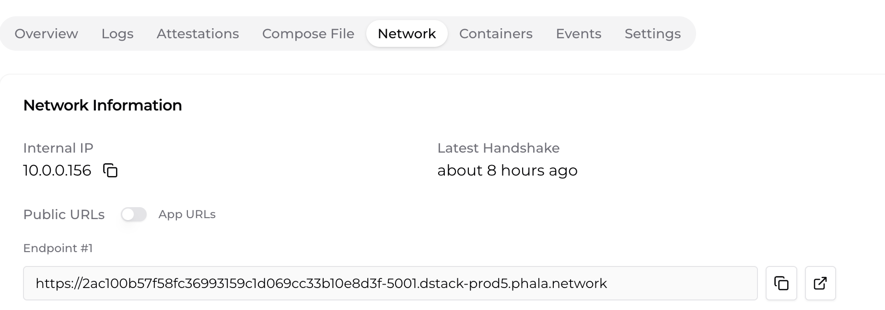

# TeeTee: Secure LLM Deployment with Layer Splitting

## Table of Contents
- [Introduction](#introduction)
- [Understanding Layer Splitting in LLMs](#understanding-layer-splitting-in-llms)
- [Technical Architecture](#technical-architecture)
- [Prerequisites](#prerequisites)
- [Deployment Steps](#deployment-steps)
  - [Preparing Your Environment](#preparing-your-environment)
  - [Setting Up Phala Cloud Account](#setting-up-phala-cloud-account)
  - [Deploying Node1 (First Half Layers)](#deploying-node1-first-half-layers)
  - [Deploying Node2 (Second Half Layers)](#deploying-node2-second-half-layers)
  - [Connecting Nodes Together](#connecting-nodes-together)
- [User Interface](#user-interface)
- [Security and Trust Considerations](#security-and-trust-considerations)
- [Troubleshooting](#troubleshooting)
- [Monitoring and Performance](#monitoring-and-performance)
- [Frequently Asked Questions](#frequently-asked-questions)
- [Advanced Configuration Options](#advanced-configuration-options)
- [References and Resources](#references-and-resources)

## Introduction

TeeTee is a secure deployment framework for running language models in Trusted Execution Environments (TEEs) using a layer-splitting approach. This innovative technique divides a large language model across multiple secure nodes, enhancing security, privacy, and potentially improving performance through parallel processing.

By running LLMs within TEEs, we can provide strong guarantees about:
- Data confidentiality: User prompts remain encrypted in memory
- Model integrity: The model code and weights cannot be tampered with
- Verifiable execution: The system generates attestation reports proving the computation was performed securely

This document provides comprehensive guidance on deploying, integrating, and using the TeeTee system.

## Understanding Layer Splitting in LLMs

In a transformer-based LLM, computation flows through multiple similar layers. Layer splitting works by:

1. Dividing the model's layers between two or more computing nodes
2. Node1 processes the input through the first half of layers
3. The intermediate hidden states are passed to Node2
4. Node2 continues processing from that exact point through the remaining layers
5. Node2 handles the final token generation phase

Benefits of this approach include:
- Enhanced security through compartmentalization
- Potential performance improvements through parallel processing
- Distributed resource utilization
- Independent scaling of different model components

Our implementation uses TinyLlama-1.1B-Chat-v1.0 split across two TEE nodes.

## Technical Architecture

TeeTee consists of the following components:

1. **Model Layer Splitting Implementation**:
   - Node1 (app1): Processes first half of model layers
   - Node2 (app2): Processes second half of model layers
   - Custom PyTorch modules that handle layer splitting and hidden state transfer

2. **Trusted Execution Environment (TEE)**:
   - Phala Network's Confidential Virtual Machines (CVMs)
   - Intel SGX-based secure execution

3. **Token Management System**:
   - Smart contracts for token-based usage
   - Contribution pool for rewarding node operators
   - Deposit and withdrawal mechanisms

4. **User Interface**:
   - Web-based chat interface
   - Model selection
   - Token management

Here's a simplified architecture diagram:

```
┌────────────────────┐         ┌────────────────────┐
│       Node1        │         │       Node2        │
│  (First N Layers)  │         │ (Remaining Layers) │
│                    │         │                    │
│  ┌──────────────┐  │         │  ┌──────────────┐  │
│  │ Input        │  │         │  │ Continue     │  │
│  │ Processing   │  │         │  │ Processing   │  │
│  └──────┬───────┘  │         │  └──────┬───────┘  │
│         │          │         │         │          │
│  ┌──────▼───────┐  │  Hidden │  ┌──────▼───────┐  │
│  │ Process      │  │  States │  │ Process      │  │
│  │ First Half   ├──┼─────────┼──► Second Half  │  │
│  │ Layers       │  │         │  │ Layers       │  │
│  └──────────────┘  │         │  └──────┬───────┘  │
│                    │         │         │          │
│  ┌──────────────┐  │         │  ┌──────▼───────┐  │
│  │ Generate     │  │         │  │ Token        │  │
│  │ Attestation  │  │         │  │ Generation   │  │
│  └──────────────┘  │         │  └──────────────┘  │
└────────────────────┘         └────────────────────┘
        │                                 │
        │                                 │
        │         ┌───────────┐           │
        └─────────► Web App   ◄───────────┘
                  │ Interface │
                  └───────────┘
```

## Prerequisites

Before beginning deployment, ensure you have:

- **Docker**: Version 20.10.0 or newer ([Docker installation guide](https://docs.docker.com/get-docker/))
- **Docker Compose**: Version 2.0.0 or newer ([Docker Compose installation guide](https://docs.docker.com/compose/install/))
- **Phala Cloud Account**: Register at [cloud.phala.network](https://cloud.phala.network/)
- **Basic Linux Command Line Knowledge**: For troubleshooting and configuration
- **Reliable Internet Connection**: For downloading model files and deployment
- **Web Browser**: For accessing Phala Cloud dashboard
- **Ethereum Wallet**: For token-based operations (if using the token system)

You can verify your Docker installation with:

```
docker --version
docker-compose --version
```

## Deployment Steps

### Setting Up Phala Cloud Account

1. **Create a Phala Cloud Account**:
   - Navigate to [cloud.phala.network](https://cloud.phala.network/)
   - Complete the registration process
   - Verify your email address

2. **Add Payment Method** (if required):
   - Navigate to the Billing section
   - Add a supported payment method
   - Consider adding credits for deployment

3. **Familiarize Yourself with the Dashboard**:
   - Explore the CVM deployment section
   - Review resource limits and pricing

### Deploying Node1 (First Half Layers)

1. **Login to Phala Cloud Dashboard**:
   - Navigate to [cloud.phala.network](https://cloud.phala.network/)
   - Sign in with your credentials

2. **Create a New CVM**:
   - Click the "Deploy a new CVM" button
   - Navigate to the "Advanced" tab as shown below:
   
   

3. **Configure the CVM with the Node1 Configuration**:
   Copy the following Docker Compose configuration into the editor:

   ```yaml
   version: '3'
   services:
     app1:
       image: derek2403/app1:latest  
       ports:
         - "5002:5002"
       environment:
         - HF_HOME=/app/models
         - TRANSFORMERS_OFFLINE=0
         - TOKENIZERS_PARALLELISM=false
         - NODE2_URL=https://2ac100b57f58fc36993159c1d069cc33b10e8d3f-5001.dstack-prod5.phala.network
       restart: on-failure:5
       volumes:
         - /var/run/tappd.sock:/var/run/tappd.sock
       healthcheck:
         test: ["CMD", "curl", "-f", "http://localhost:5002/health"]
         interval: 30s
         timeout: 10s
         retries: 3
         start_period: 180s
       dns:
         - 8.8.8.8
         - 8.8.4.4
   ```

   > **Important**: This configuration deploys the first half of the TinyLlama-1.1B-Chat-v1.0 model layers.

4. **Adjust Resources** (optional):
   - Set CPU and memory requirements based on your needs
   - For TinyLlama-1.1B, 4GB memory is typically sufficient for Node1

5. **Deploy the CVM**:
   - Click "Deploy"
   - Wait for the deployment to complete (5-10 minutes)
   - The system will download the model and initialize the container

6. **Obtain the Public Endpoint**:
   - Navigate to the "Network" tab of your deployed CVM
   - Copy the public endpoint URL as shown below:
   
   
   
   - Save this URL as you'll need it to configure Node2

7. **Verify Node1 Deployment**:
   - Test the health endpoint by visiting `https://your-node1-url/health`
   - You should receive a JSON response with status "ok"

### Deploying Node2 (Second Half Layers)

Follow a similar process as Node1, but with the appropriate Node2 configuration:

1. **Create a New CVM for Node2**
2. **Use the Node2 Docker Compose Configuration**:

   ```yaml
   version: '3'
   services:
     app2:
       image: derek2403/app2:latest
       ports:
         - "5001:5001"
       environment:
         - HF_HOME=/app/models
         - TRANSFORMERS_OFFLINE=0
         - TOKENIZERS_PARALLELISM=false
       restart: on-failure:5
       volumes:
         - /var/run/tappd.sock:/var/run/tappd.sock
       healthcheck:
         test: ["CMD", "curl", "-f", "http://localhost:5001/health"]
         interval: 30s
         timeout: 10s
         retries: 3
         start_period: 180s
       dns:
         - 8.8.8.8
         - 8.8.4.4
   ```

3. **Deploy and Verify Node2**
4. **Record the Node2 Public Endpoint URL**

### Connecting Nodes Together

1. **Update Node1 Configuration**:
   - If you deployed Node2 first, you may need to update Node1's `NODE2_URL` environment variable
   - This can be done by redeploying Node1 with the updated URL

2. **Test the Complete Pipeline**:
   - Send a test request to Node1's `/generate` endpoint
   - Verify that you receive a response that has passed through both nodes
   - Check that attestation reports are included from both nodes

3. **Connect to Your Application**:
   - Update your application's API configuration to point to Node1's endpoint
   - Use the `/generate` endpoint for sending prompts and receiving completions


## User Interface

The TeeTee system includes a web-based chat interface (`pages/chat.js`) that allows users to:
- Select a model to use
- Send prompts to the model
- View responses with attestation information
- Manage tokens

The chat interface handles model selection validation, token payments for non-self-hosted models, and displaying responses with attestation proofs.

Key features:
- Automatic token calculation based on character counts
- Smart contract integration for token payments
- Different handling for self-hosted vs. non-self-hosted models
- Visual feedback on token balance and usage

## Security and Trust Considerations

- **Attestation Reports**: Each node generates attestation reports that can be verified to ensure the code is running in a genuine TEE
- **Data Privacy**: All user prompts and model weights remain encrypted in memory
- **Model Security**: The model cannot be extracted or modified within the TEE
- **Transport Security**: Communication between nodes uses TLS encryption
- **Trust Model**: The system provides end-to-end verifiability through the TEE attestation chain
- **Token Security**: Smart contract interactions are secured through standard Ethereum transaction mechanisms

## Troubleshooting

### Common Issues and Solutions

1. **Node1 Cannot Connect to Node2**:
   - Verify Node2 URL is correct in Node1's environment variables
   - Check that both nodes are running (health endpoints)
   - Ensure network rules allow communication between nodes

2. **Slow Model Loading**:
   - First load will download model files which may take time
   - Subsequent restarts will be faster

3. **Out of Memory Errors**:
   - Increase the memory allocation for your CVM
   - Consider using a smaller model or more efficient format

4. **Smart Contract Interaction Failures**:
   - Ensure you have sufficient ETH for gas fees
   - Check that you're connected to the correct network
   - Verify contract addresses are correct

5. **Missing Attestation Reports**:
   - Ensure the TEE is properly configured
   - Check for error messages in the logs

## Monitoring and Performance

- **Health Endpoints**: Both nodes expose `/health` endpoints for monitoring
- **Performance Metrics**: Check generation times in the API responses
- **Phala Dashboard**: Monitor resource usage through the Phala Cloud interface
- **Token Metrics**: Monitor token usage and balances through the web interface
- **Logs**: Review container logs for detailed information

## Frequently Asked Questions

**Q: What model is currently supported?**
A: We currently support TinyLlama-1.1B-Chat-v1.0, but the architecture can be adapted for other models.

**Q: Can I use my own custom model?**
A: Yes, but you would need to build custom Docker images with your model files.

**Q: How secure is the layer splitting approach?**
A: Very secure. Even if one node is compromised, the attacker would only have access to part of the model computation.

**Q: What's the cost of running this setup?**
A: Costs depend on Phala Cloud pricing and the resources allocated to your CVMs.

**Q: How are tokens used in the system?**
A: Tokens are used to pay for model inference (1 token per character), and to reward node operators through the contribution pool.

**Q: Can I deploy this on my own infrastructure instead of Phala Cloud?**
A: While possible, using Phala Cloud ensures proper TEE configuration and attestation. For custom deployments, you would need to set up your own SGX-enabled environment.

## Advanced Configuration Options

For advanced users, the following customization options are available:

- **Custom Model Paths**: Configure alternative model storage locations
- **Generation Parameters**: Adjust temperature, top-p, and max tokens
- **Network Configuration**: Customize network settings for improved security or performance
- **Memory Optimization**: Configure memory usage for different model sizes
- **Token Economics**: Adjust token rates and reward distribution
- **Custom Splitting Architectures**: Modify the layer splitting approach for different models

## References and Resources

- [Phala Network Documentation](https://docs.phala.network/)
- [Intel SGX Documentation](https://www.intel.com/content/www/us/en/developer/tools/software-guard-extensions/overview.html)
- [TinyLlama Model Repository](https://huggingface.co/TinyLlama/TinyLlama-1.1B-Chat-v1.0)
- [Transformers Documentation](https://huggingface.co/docs/transformers/index)
- [Docker Compose Reference](https://docs.docker.com/compose/compose-file/)
- [Ethereum Smart Contract Documentation](https://ethereum.org/en/developers/docs/smart-contracts/)

---

**Congratulations!** You have successfully deployed your layer-split LLM in a TEE environment. Your model is now running in a highly secure, privacy-preserving configuration that protects both user data and model integrity.

For additional support, please reach out to our community forum or open an issue in our GitHub repository.
